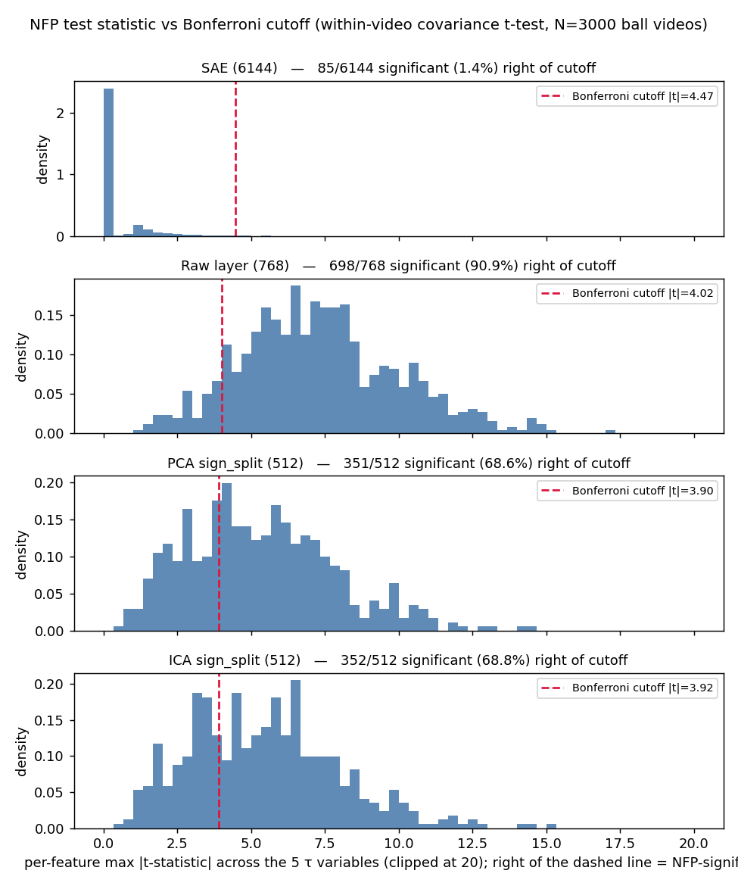

# PCA / ICA baselines — complete results and methods

---

## Contents
- §0 Background: what this study is and why these baselines exist
- §1 Glossary: the models, the four "bases", and the kinematic variables
- §2 The two measurements, defined from scratch (MS score; NFP temporal test)
- §3 Result — Monosemanticity (MS) scores
- §4 Result — NFP temporal test (counts, per-variable, selectivity matrices)
- §5 Result — dimensionality sweep on VideoMAE (does the number of components matter?)
- §6 Result — control datasets (DINO negative control; synthetic positive control), incl. their sweeps
- §7 Overall conclusions
- §8 Reproducibility: exact procedures and file map

---

## 0. Background — what this study is and why these baselines exist

The larger project trains a **Sparse Autoencoder (SAE)** on top of a frozen video transformer
(**VideoMAE**) to show that some of the model's features encode **temporal** concepts (how fast / which way things move etc). The question that 
naturally follows is that:

**Is the SAE actually special?** Maybe any way of re-describing the network's activations, like the
   classical **PCA** or **ICA**, would find the same temporal structure equally well. If so, the SAE adds nothing.
2. **Does the SAE's apparent success survive controls?** We re-run everything on a dataset where
   the answer must be "nothing temporal here" (negative control) and on a dataset where we
   *planted* the temporal structure ourselves and know the ground truth (positive control).

We therefore compare **four "bases"** (defined in §1) on **two measurements** (defined in §2), on
the main data and on the two controls, and we vary the dimension D of PCA and ICA to see how this effects the final results.

---

## 1. the models, the four bases, and the kinematic variables

**VideoMAE.** A vision transformer (`MCG-NJU/videomae-base-finetuned-ssv2`) that ingests a video
and produces, at each internal layer, a vector for every space-time patch ("token"). We always
read **layer 11, the post-MLP residual stream**, which is a **768-dimensional** vector per token.
Everything below operates on these 768-dim activations.

**A "basis" (a.k.a. filter / dictionary).** A recipe that re-expresses a 768-dim activation `x`
as a list of **feature activations**. We compare four:

| Basis | # features | What it is | "Trained"? |
|---|---|---|---|
| **SAE** (Sparse Autoencoder) | **6144** | A 1-hidden-layer neural net trained to reconstruct `x` from a *sparse, non-negative* code (ReLU); 8× more features than dimensions ("overcomplete"). Learns its own directions. | Yes — gradient-trained on VideoMAE activations |
| **Raw layer** | **768** | The identity: each VideoMAE neuron *is* a feature. No transform. | No |
| **PCA** | up to 768 (we varies this to see how the amount of selected features impact the results) | Principal Component Analysis: the orthogonal directions of maximum variance. | Fit (closed-form eigendecomposition) |
| **ICA** | same | Independent Component Analysis (FastICA): directions that are as statistically independent / non-Gaussian as possible. | Fit (iterative `FastICA`) |

**sign-split (why PCA/ICA have 512 features from 256 components).** PCA/ICA components are
**signed** numbers (a component can be positive or negative), whereas an SAE feature is a
**non-negative** ReLU activation ("the concept is present, by this much"). To make the comparison
fair we map each signed component `c` to **two** non-negative features,
`[ReLU(c), ReLU(−c)]` — a "+pole" and a "−pole". So **256 components → 512 sign-split features**.
 As a robustness check we also report **signed** mode (use the raw signed component as one feature, 256 components → 256 features); results there are similar and flagged where they differ.

**The kinematic variables τ (tau).** In the temporal test (§2b) we ask whether a feature tracks
*motion*. "Motion" is made concrete by **five scalar quantities measured per frame**, collectively
called **τ**:

| τ variable | meaning |
|---|---|
| `speed` | magnitude of velocity |
| `vel_x` | horizontal velocity (signed) |
| `vel_y` | vertical velocity (signed) |
| `accel_mag` | magnitude of acceleration |
| `direction` | heading angle of motion |

**The two datasets.**
- **SSv2** (Something-Something-v2): real human-action videos. Used for the MS score (§2a). We
  score on **800 validation clips**.
- **Ball dataset**: **3000 synthetic videos** of a single ball moving on a plain background, 16
  frames each (grouped into 8 "temporal steps"). For every frame we know the ground-truth τ values
  **and** which spatial token contains the ball. Used for the NFP temporal test (§2b). A small set
  of example clips (varied speeds and motion profiles — turns, oscillations, accelerations, and an
  off-frame exit) is in `demo/nfp/` (see `demo/nfp/manifest.md`); regenerate with
  `analysis/make_nfp_demo.py`.

---

## 2. The two measurements — defined from scratch

### 2a. Monosemanticity score (MS) — "does this feature fire on a visually coherent set of clips?"

**Idea.** A feature is *monosemantic* if the inputs that activate it look alike. Given a set of images, for each neuron and a pair of images in the set, the MS score takes in the product of normalized activation values of both images for this specific neuron, and times it with the cosine similarity between the embedding vectors of these two images by an independent image encoder (in our case DinoV2). The sum of these pairwise score gives the MS score of this perticular neuron.
We are aware that the current monosemanticity mesurement is encoder-dependent, meaning the choice of the encoder can directly impact the MS score of the same model; Also we acknowledge that since the MS score takes in consideration of only cosine similarity of pairs of images's encoding vector through an image encoder, it is likely that temporal features are not captured in such encoding, meaning any neuron / features that is highly temporal can score poorly on the MS score but still being tied to very sepecific concepts.

**Independent encoder.** We embed each clip with **DINOv2-base** (`facebook/dinov2-base`), a
*different* self-supervised vision model. Per clip we take DINOv2's pooled output, max-pooled over
the 16 frames, giving one embedding vector `e_i` per clip. (Using a different model than the one
being interpreted avoids circular "the model says it's similar to itself" reasoning.)

**Exact calculation (per feature `n`).**
1. Run all 800 val clips through VideoMAE → the basis → take feature `n`'s activation on each clip,
   max-pooled over that clip's tokens: a number `a_n(i)` for clip `i`.
2. **Min-max scale** those 800 numbers to `[0,1]`: `ã_n(i) = (a_n(i) − min) / (max − min)`. (So
   "barely on" ≈ 0 and "most on" ≈ 1; this makes features comparable.)
3. The score is the **activation-weighted average pairwise visual similarity**:

   **MS_n = Σ_{i<j} ã_n(i)·ã_n(j)·cos(e_i, e_j)  /  Σ_{i<j} ã_n(i)·ã_n(j)**

   i.e. for every pair of clips, weight = product of the (scaled) activations (pairs where the
   feature is strongly on for *both* clips count most), and the value being averaged is the cosine
   similarity of the two clips' DINOv2 embeddings. **MS_n ∈ [−1, 1]; higher = more monosemantic**
   (the clips that drive the feature look alike).

**What we report for a basis** (a distribution of MS over its features):
- **mean ± std** — average monosemanticity and its spread across features.
- **peak** — the single most monosemantic feature (the maximum MS).
- **dead** — count of features that never activate (excluded from mean/std).

This metric follows Bricken et al. 2023 / Pach et al. 2025.

### 2b. NFP temporal test — "does this feature track motion *within* a video, with no false positives?"

"NFP" = **No-False-Positives**: the test is built so that a feature only passes if it has a
*genuine, statistically reliable* relationship with motion, not a chance one.

**Setup.** On the ball dataset, for feature `i`, video `V`, and temporal step `t`, let
`ψ_i(V,t)` = the feature's activation **at the spatial token that contains the ball** at step `t`.
Let `τ_k(V,t)` = the ground-truth value of kinematic variable `k` at that step. There are `T = 8`
steps per video.

**Step 1 — within-video covariance.** For each video, compute how the feature co-varies with the
kinematic variable *over time within that one video*:

**C_i(V, k) = (1/T) · Σ_t (ψ_i(V,t) − meanₜ ψ_i) · (τ_k(V,t) − meanₜ τ_k)**

This is the time-covariance between the feature and τ_k inside video `V`. (Doing it *within* each
video removes between-video confounds — we only ask "as the ball speeds up *in this clip*, does the
feature change?")

**Step 2 — one-sample t-test across the 3000 videos.** For feature `i` and variable `k`, take the
3000 numbers `{C_i(V,k)}` and run a **one-sample t-test against 0**: is their mean reliably
nonzero? This yields a **t-statistic** `t_i,k` (effect size in standard-error units) and a
**p-value** `p_i,k` (probability of seeing this if the true covariance were 0).

**Step 3 — Bonferroni significance threshold.** Because we run many tests at once (one per
feature × per τ), some will look "significant" by chance. The **Bonferroni correction** guards
against this by dividing the usual α = 0.05 by the number of tests. We use **`p < α/D`** where
**D = number of features** in the basis. A feature is **"significant"** if it passes for **at least
one** of the 5 τ variables. (E.g. for the 512-feature PCA the bar is `p < 0.05/512 ≈ 9.8×10⁻⁵`.)

> **Note on the threshold.** This is a *significance* (reliability) threshold, not an *effect-size*
> threshold. With N = 3000 videos the test is very high-powered, so even a *tiny but consistent*
> covariance is "significant." This matters below: PCA/ICA/raw flag most features because nearly
> every linear direction has a small-but-real motion covariance — what distinguishes the SAE is
> not a stricter bar but that its temporal signal is concentrated in few features.

**The numbers this test produces, and what each means:**

- **"Significant ≥1 τ" (a.k.a. %sig, "sparsity").** The count (and fraction) of features that pass
  the bar for at least one τ. **Lower = sparser** = the temporal signal is localized to fewer
  features. *This is the axis on which methods differ most.* (When this document says a basis is
  "selective" without qualification, it means **sparse** in this sense.)

- **"Non-sig mean |C|".** Among the features that did *not* pass, the average absolute within-video
  covariance. It measures how close to zero the non-flagged features actually sit (a small value
  means the unflagged features are genuinely inert, not borderline).

- **Selectivity matrix and "diagonal dominance" (a.k.a. specificity).** A *separate* question from
  sparsity: of the features flagged for a given variable, do they respond *specifically* to that
  variable? Build a **5×5 matrix** whose entry at (row τ_A, column τ_B) is the **mean |t-statistic|
  on τ_B, averaged over the features that were significant for τ_A**. A basis is
  **"diagonal-dominant"** if, in *every* row, the **diagonal entry is the largest in its row** —
  i.e. a feature flagged for `speed` reacts most strongly to `speed`, not to some other variable.
  Diagonal dominance is a *per-flagged-feature quality* and says **nothing** about *how many*
  features were flagged.

**Two independent axes — keep them apart (this was a common confusion):**
- **Sparsity** = *how few* features fire (the %sig column). 
- **Diagonal dominance / specificity** = *how cleanly* each flagged feature maps to one variable.

A basis can have one without the other. As we'll see, PCA/ICA are **diagonal-dominant but dense**
(clean per-feature mapping, yet most features flagged); the raw layer is **neither**; the SAE is
**sparse** and *mostly* diagonal-dominant.

### 2c. How the bases are produced (the "training/fitting" procedure)

- **SAE**: trained separately (gradient descent) on VideoMAE layer-11 activations to reconstruct
  them from a sparse ReLU code (6144 features) using SSv2 dataset.
- **PCA / ICA fit**: we collect a subsample of VideoMAE layer-11 activations (~600k token-vectors
  drawn from 400 SSv2-train videos), then fit **256 components** with scikit-learn (`PCA` with a
  randomized SVD solver; `FastICA` with unit-variance whitening). PCA and ICA are fit on the *same*
  subsample for a fair comparison. The fitted "mean + components" are saved and wrapped as
  `PCADict`/`ICADict`. (`fit_pca_ica.py`.)
- **Raw layer**: no fitting; the identity.

---

## 3. Result — Monosemanticity (MS) scores

Computed exactly as in §2a (800 SSv2-val clips, DINOv2 embeddings). PCA/ICA use 256 components →
512 sign-split features.

| Basis | # features | MS mean ± std | Peak | Dead | Diagonal-dominant (from §4) |
|---|---|---|---|---|---|
| **SAE** (cluster / paper) | 6144 | **0.475 ± 0.063** | **0.802** | 5 | Yes |
| Raw layer (local) | 768 | 0.469 ± 0.007 | 0.490 | 0 | No |
| PCA (sign_split, local) | 512 | 0.467 ± 0.006 | 0.497 | 0 | Yes |
| ICA (sign_split, local) | 512 | 0.467 ± 0.009 | 0.510 | 0 | Yes |

**How to read it.** The **means are nearly identical** across all four (~0.467–0.475) — on
*average* a PCA/ICA/raw feature is about as monosemantic as an SAE feature. The difference is in
the **spread and the tail**: the SAE's std is **7–10× larger**, and its **peak is 0.80** versus
~0.50 for every linear basis. In other words, only the SAE produces a *sub-population of
strongly-monosemantic features* (a high-MS tail). The linear bases produce features that are all
mediocre-and-similar. Per-feature top/bottom-10 lists: `ms_pca_sign_split.txt`,
`ms_ica_sign_split.txt`, `ms_sae_local.txt`. Full comparison: `ms_scores.md`.

### 3a. Are the SAE's *temporal* features its high-MS features? (No — MS undercredits them)

Cross-referencing, for the same SAE, each feature's MS score against the NFP temporal-significance
mask (§4) answers a natural question: are the temporal features also the monosemantic ones?

| Group | n | MS mean | MS max | # MS > 0.7 |
|---|---|---|---|---|
| All (live) features | 6088 | 0.468 | **0.782** | 8 |
| **NFP-temporal** features | 85 | **0.441** | **0.542** | 0 |

**No** — the 85 temporal features are *slightly below* average MS (0.441 vs 0.468), top out at
0.54, and **none** reach the high-MS tail (the 8 features above 0.70 are all non-temporal); they
sit at the ~36th MS percentile. **Why:** MS rewards firing on *visually similar* clips (DINOv2
image similarity, §2a), but a real temporal feature ("moving fast") fires across clips that look
*different*, so it scores low MS despite being a good temporal feature. I.e. **the image-based MS
metric structurally undercredits temporal features** — motivating a temporal-specific MS redesign
(weight by motion similarity, or score against the temporal subspace as done on the synthetic
control). Full breakdown + per-τ table: `ms_vs_temporal.md` (reproduce: `analysis/ms_vs_temporal.py`).

---

## 4. Result — NFP temporal test (VideoMAE, main result)

Computed exactly as in §2b on the 3000-video ball dataset. "Significant" = passes `p < 0.05/D` for
≥1 τ.

| Basis | # features | Significant ≥1 τ (sparsity) | Diagonal-dominant (specificity) | Non-sig mean \|C\| |
|---|---|---|---|---|
| **SAE** (cluster / paper) | 6144 | **75 (1.22%)** | Yes | — |
| Raw layer (local) | 768 | 698 (90.9%) | No | 1.5×10⁻² |
| PCA (sign_split, local) | 512 | 351 (68.6%) | Yes | 7.7×10⁻³ |
| ICA (sign_split, local) | 512 | 352 (68.8%) | Yes | 8.4×10⁻⁴ |

**Headline:** only the SAE is **sparse** — it flags **1.2%** of its features as temporal, versus
**69–91%** for the linear/raw bases. The temporal signal is *real* in all of them (the bar is a
genuine significance test), but only the SAE *localizes* it to a handful of features.

### 4a. Per-τ significant-feature counts (which variables, and sign of the relationship)

`Sig+` / `Sig−` = number of features with significant **positive** / **negative** covariance with
that τ. (`%` is of all features in that basis.) These come from the local same-pipeline run so all
four sit on one footing; the SAE row here is the local validation run (85 total).

**SAE** (D=6144, bar `p < 8.1×10⁻⁶`), total **85/6144 (1.38%)**, non-sig mean |C| = 2.37×10⁻⁴:

| τ | Sig+ | Sig− | total% |
|---|---|---|---|
| speed | 15 | 25 | 0.65% |
| vel_x | 16 | 24 | 0.65% |
| vel_y | 13 | 11 | 0.39% |
| accel_mag | 3 | 10 | 0.21% |
| direction | 8 | 7 | 0.24% |

**Raw layer** (D=768, bar `p < 6.5×10⁻⁵`), total **698/768 (90.9%)**, non-sig mean |C| = 1.50×10⁻²:

| τ | Sig+ | Sig− | total% |
|---|---|---|---|
| speed | 145 | 147 | 38.0% |
| vel_x | 200 | 201 | 52.2% |
| vel_y | 164 | 147 | 40.5% |
| accel_mag | 213 | 168 | 49.6% |
| direction | 148 | 143 | 37.9% |

**PCA** (512 sign-split, bar `p < 9.8×10⁻⁵`), total **351/512 (68.6%)**, non-sig mean |C| = 7.75×10⁻³:

| τ | Sig+ | Sig− | total% |
|---|---|---|---|
| speed | 51 | 86 | 26.8% |
| vel_x | 96 | 80 | 34.4% |
| vel_y | 64 | 68 | 25.8% |
| accel_mag | 60 | 110 | 33.2% |
| direction | 51 | 60 | 21.7% |

**ICA** (512 sign-split, bar `p < 9.8×10⁻⁵`), total **352/512 (68.8%)**, non-sig mean |C| = 8.39×10⁻⁴:

| τ | Sig+ | Sig− | total% |
|---|---|---|---|
| speed | 54 | 91 | 28.3% |
| vel_x | 112 | 80 | 37.5% |
| vel_y | 72 | 70 | 27.7% |
| accel_mag | 72 | 96 | 32.8% |
| direction | 58 | 67 | 24.4% |

### 4b. Selectivity (diagonal-dominance) matrices

Each entry = **mean |t-statistic| on the column-τ, averaged over the features significant for the
row-τ** (defined in §2b). A `*` marks the row maximum; **diagonal-dominant** = the starred entry is
on the diagonal in every row.

**SAE** (local validation run) — **diagonal-dominant: No** (the `direction` row peaks on `vel_y`):

| sig in \ measured | speed | vel_x | vel_y | accel_mag | direction |
|---|---|---|---|---|---|
| speed | **6.19*** | 3.22 | 2.98 | 2.71 | 2.40 |
| vel_x | 3.67 | **6.32*** | 2.76 | 2.26 | 2.21 |
| vel_y | 4.02 | 3.55 | **6.19*** | 2.53 | 4.88 |
| accel_mag | 4.99 | 2.41 | 2.54 | **5.67*** | 2.62 |
| direction | 3.99 | 2.75 | 6.54 | 2.99 | 6.24* |

*(The reported cluster SAE is diagonal-dominant; this local run is 4/5 rows — see the validation
note. Either way the SAE's defining property is sparsity, not this matrix.)*

**Raw layer** — **diagonal-dominant: No**:

| sig in \ measured | speed | vel_x | vel_y | accel_mag | direction |
|---|---|---|---|---|---|
| speed | **6.43*** | 4.73 | 3.90 | 4.22 | 3.70 |
| vel_x | 3.60 | **7.37*** | 3.84 | 3.98 | 3.60 |
| vel_y | 3.61 | 4.83 | **6.79*** | 3.92 | 6.21 |
| accel_mag | 3.74 | 4.72 | 3.76 | **6.07*** | 3.52 |
| direction | 3.62 | 4.87 | 6.71 | 3.85 | 6.60* |

**PCA** — **diagonal-dominant: Yes**:

| sig in \ measured | speed | vel_x | vel_y | accel_mag | direction |
|---|---|---|---|---|---|
| speed | **5.75*** | 4.03 | 2.96 | 3.74 | 3.08 |
| vel_x | 3.13 | **6.53*** | 3.16 | 3.36 | 3.02 |
| vel_y | 2.99 | 3.93 | **5.94*** | 3.36 | 5.36 |
| accel_mag | 3.53 | 3.96 | 3.01 | **5.51*** | 2.83 |
| direction | 3.12 | 4.09 | 5.92 | 3.43 | **6.03*** |

**ICA** — **diagonal-dominant: Yes**:

| sig in \ measured | speed | vel_x | vel_y | accel_mag | direction |
|---|---|---|---|---|---|
| speed | **5.88*** | 4.39 | 3.52 | 3.52 | 3.40 |
| vel_x | 3.23 | **6.61*** | 3.36 | 3.56 | 3.06 |
| vel_y | 3.65 | 4.52 | **5.84*** | 3.71 | 5.22 |
| accel_mag | 3.43 | 4.33 | 3.31 | **5.58*** | 3.04 |
| direction | 3.62 | 4.22 | 5.71 | 3.79 | **5.75*** |

**Reading 4a–4b together.** PCA and ICA are **diagonal-dominant** — their flagged features *do*
map cleanly to one variable each — yet they are **dense** (69% flagged). So clean per-feature
specificity is *not* unique to the SAE; **sparsity is**. The raw layer is the worst of both:
dense *and* not diagonal-dominant. (Full per-condition file: `nfp_selectivity.md`.)

### 4c. Where the features fall relative to the cutoff (the distribution)

The "% significant" numbers are just counts on one side of a threshold; the picture below shows
the *whole distribution* so the threshold is in context. For each feature we take its **strongest
temporal signal** = the maximum, over the 5 τ variables, of the |t-statistic| from the NFP test
(§2b). A feature is significant iff this exceeds the **Bonferroni cutoff** (the red dashed line;
equivalently min p-value < α/D — and since all features share the same degrees of freedom, max|t|
is monotonic in the p-value, so this line reproduces the significance call exactly).

*(Reproduce: `python analysis/cutoff_distribution.py` → `figures/cutoff_distribution.png`.)*

Reading the four panels (cutoff |t| ≈ 3.9–4.5):
- **SAE**: the bulk of features sits at |t| ≈ 1–2, **left of the cutoff**, with only a thin tail
  crossing it — the visual signature of **sparsity** (1.4% pass).
- **Raw layer**: the entire distribution is shifted to the **right of the cutoff** — almost every
  raw neuron has a statistically reliable (if tiny) motion covariance, so 90.9% pass.
- **PCA / ICA**: the bulk straddles and mostly sits to the **right of the cutoff** (≈69% pass) —
  denser than the SAE, less extreme than raw.

This makes concrete the §2b note: with N=3000 videos the test is high-powered, so the *position*
of a basis's distribution relative to the cutoff — not the cutoff itself — is what produces the
sparse-vs-dense contrast. Only the SAE concentrates its mass below the bar.

---

## 5. Result — dimensionality sweep on VideoMAE (does the number of components matter?)

**What this procedure is.** The obvious objection to "PCA/ICA are dense" is: *maybe you just chose
the wrong number of components D.* So we **sweep D = 16, 32, 64, 128, 256, 512, 768** and recompute
MS and NFP at each. To make this cheap, the VideoMAE forward passes (which don't depend on D) are
**cached once**; then each D is evaluated as fast linear algebra. PCA is **nested** (fit once at
the largest D, then use the top-D components — they don't change), so the PCA peak/structure is
literally identical across D. ICA is **refit** at every D (its solution changes with D).
(`analysis/sweep_pca_ica_dim.py`; runner `jobs/local/run_sweep_local.ps1`; CSV
`sweep_dim_fixed768.csv`.)

**Two significance cutoffs are reported.** Because the Bonferroni bar `α/D` *tightens* as the
feature count grows, comparing raw counts across D is confounded. So each row reports the %
significant under **both**:
- **%sig (α/M)** — the *adaptive* bar, denominator = the basis's own feature count M.
- **%sig (α/768)** — a **D-independent** bar, denominator fixed at 768 (the raw layer
  dimensionality). Holding the denominator fixed isolates the change in the *underlying count* of
  temporal features from the change in the multiple-comparisons correction.

**ICA numerics — why the ICA rows at D = 512 and 768 are blank ("FastICA NaN").** Unlike PCA,
ICA has no closed-form solution: `FastICA` is an **iterative** algorithm, and at large component
counts it breaks down numerically on this data. A NaN row means *"ICA could not be estimated at
this D"* — there is simply no result to report, so the cell is left empty. Concretely:

- **What FastICA does.** It first **whitens** the data — rotates and rescales it so every direction
  has unit variance — which internally divides by the square roots of the data's variances along
  each direction. It then **iterates** a fixed-point update to rotate toward maximally
  non-Gaussian (independent) directions.
- **Why it blows up at high D.** Layer-11 activations are effectively **low-rank**: most of the
  variance lives in a few hundred directions, and the remaining directions carry almost none. When
  D is pushed to 512–768, the whitening step starts dividing by **near-zero variances**, which
  inflates those directions to enormous (eventually infinite) values. The iterative update then
  propagates those `Inf`s into `NaN`s, and scikit-learn aborts with *"array must not contain infs
  or NaNs."* (Large D also makes the fixed-point iteration harder to converge, compounding it.)
- **Why PCA is fine at the same D.** PCA is a single, stable eigendecomposition — it never divides
  by tiny variances or iterates a nonlinear update, so it completes at every D (the extra
  directions are just low-variance, not numerically explosive).

**What it means for the conclusions: nothing changes.** This is a known limitation of the FastICA
*algorithm* at high dimensionality on near-low-rank data — **not** a property of the temporal
signal, and **not** a bug in our pipeline (we catch the error and record a NaN row instead of
crashing). The story is unaffected because (i) PCA covers the full D range and stays dense, and
(ii) at every D where ICA *does* run (≤256) it is already dense (~63–70%). The fragility is itself
a small practical mark against ICA versus PCA/SAE.

> **Two distinct ICA failure modes appear in this report.** *NaN / abort* (here, D≥512) means the
> computation produced infinities and returned **no** result. *Non-convergence* (the synthetic
> control, §6b) means FastICA **ran to its iteration cap without settling** and returned a
> low-quality result — different symptom, same root cause (FastICA is unstable on these inputs).
> On the DINO control (§6a) ICA happened to converge cleanly (66 iterations) because those
> activations are better-conditioned — so the instability is **data-dependent**, not universal.

The four cases — {PCA, ICA} × {sign_split, signed} — are shown separately below so the trend in
**% significant as D grows** is visible for each. (`feats` = feature count M = 2·D for sign_split,
D for signed; `%sig (α/M)` is the adaptive cutoff, `%sig (α/768)` the D-independent one.)

#### NFP %significant vs D — all four cases at a glance (adaptive α/M cutoff)

| D | PCA · sign_split | ICA · sign_split | PCA · signed | ICA · signed |
|---|---|---|---|---|
| 16 | 59.38% | 62.50% | 87.50% | 93.75% |
| 32 | 59.38% | 65.62% | 87.50% | 93.75% |
| 64 | 59.38% | 68.75% | 82.81% | 90.62% |
| 128 | 66.02% | 67.97% | 88.28% | 91.41% |
| 256 | 66.60% | 70.51% | 89.84% | 91.02% |
| 512 | 69.43% | NaN | 91.02% | NaN |
| 768 | 68.82% | NaN | 90.89% | NaN |

Trend: in **sign_split**, % rises gently with D (PCA 59→69%, ICA 62→71%); in **signed**, % stays
high and roughly flat (PCA ~83–91%, ICA ~91–94%). In **no** case does it fall toward the SAE's
1.2% — increasing D never buys sparsity. ICA's column ends at D=256 (FastICA NaNs at D≥512, §5
above). Detailed per-case tables (with the fixed α/768 cutoff, MS, and diagonal dominance) follow.

#### PCA · sign_split

| D | feats | MS mean | MS peak | %sig (α/M) | %sig (α/768) | diag-dominant |
|---|---|---|---|---|---|---|
| 16 | 32 | 0.4677 | 0.497 | 59.38% | 46.88% | No |
| 32 | 64 | 0.4675 | 0.497 | 59.38% | 51.56% | Yes |
| 64 | 128 | 0.4666 | 0.497 | 59.38% | 50.00% | No |
| 128 | 256 | 0.4669 | 0.497 | 66.02% | 59.77% | Yes |
| 256 | 512 | 0.4672 | 0.497 | 66.60% | 64.45% | Yes |
| 512 | 1024 | 0.4677 | 0.497 | 69.43% | 70.12% | Yes |
| **768** | **1536** | **0.4677** | **0.497** | **68.82%** | **71.03%** | No |

#### ICA · sign_split

| D | feats | MS mean | MS peak | %sig (α/M) | %sig (α/768) | diag-dominant |
|---|---|---|---|---|---|---|
| 16 | 32 | 0.4677 | 0.511 | 62.50% | 46.88% | No |
| 32 | 64 | 0.4675 | 0.512 | 65.62% | 62.50% | Yes |
| 64 | 128 | 0.4672 | 0.515 | 68.75% | 64.06% | No |
| 128 | 256 | 0.4676 | 0.519 | 67.97% | 66.41% | Yes |
| 256 | 512 | 0.4674 | 0.512 | 70.51% | 69.53% | Yes |
| 512 | 1024 | — | — | — | — | FastICA NaN |
| 768 | 1536 | — | — | — | — | FastICA NaN |

#### PCA · signed

| D | feats | MS mean | MS peak | %sig (α/M) | %sig (α/768) | diag-dominant |
|---|---|---|---|---|---|---|
| 16 | 16 | 0.4658 | 0.484 | 87.50% | 75.00% | Yes |
| 32 | 32 | 0.4642 | 0.484 | 87.50% | 81.25% | No |
| 64 | 64 | 0.4645 | 0.484 | 82.81% | 81.25% | No |
| 128 | 128 | 0.4657 | 0.484 | 88.28% | 85.16% | No |
| 256 | 256 | 0.4667 | 0.484 | 89.84% | 88.28% | No |
| 512 | 512 | 0.4675 | 0.484 | 91.02% | 90.43% | No |
| **768** | **768** | **0.4676** | **0.484** | **90.89%** | **90.89%** | No |

#### ICA · signed

| D | feats | MS mean | MS peak | %sig (α/M) | %sig (α/768) | diag-dominant |
|---|---|---|---|---|---|---|
| 16 | 16 | 0.4686 | 0.484 | 93.75% | 62.50% | Yes |
| 32 | 32 | 0.4669 | 0.495 | 93.75% | 84.38% | No |
| 64 | 64 | 0.4659 | 0.500 | 90.62% | 85.94% | No |
| 128 | 128 | 0.4667 | 0.514 | 91.41% | 86.72% | Yes |
| 256 | 256 | 0.4673 | 0.502 | 91.02% | 88.28% | No |
| 512 | 512 | — | — | — | — | FastICA NaN |
| 768 | 768 | — | — | — | — | FastICA NaN |

**Internal consistency check.** At **D = 768 signed**, the feature count M = 768 equals the fixed
denominator, so the two cutoffs must coincide — and the count is **698/768 (90.89%), exactly equal
to the raw layer**. This is expected: full-rank signed PCA is just an orthogonal *rotation* of the
768 raw dimensions, and the per-feature t-test significant-count is rotation-invariant. (A good
sanity check that the pipeline is correct.)

**Conclusions from the sweep.**
1. **More components do not help.** Even at full rank (D=768) PCA flags 68.8% (sign_split) / 90.9%
   (signed) — nowhere near the SAE's 1.2%.
2. **The denseness is not a cutoff artifact.** Switching from the adaptive `α/M` to the fixed
   `α/768` bar moves the fractions only a few points; PCA/ICA stay in the **~47–91%** band at every
   D under either bar.
3. **No high-MS tail at any D.** MS mean stays ~0.467 and MS peak stays ~0.50 (PCA) / ~0.51 (ICA)
   across all D — the SAE's 0.80 peak never appears for a linear basis.
4. **Diagonal dominance is mode-dependent and noisy** (it depends on having enough flagged
   features to average), which is one more reason `sign_split` is the primary mode and `signed` is
   only a robustness check.

---

## 6. Result — control datasets

The same PCA/ICA machinery is run on two datasets where we *know* the right answer.

### 6a. DINO negative control — "a model that *cannot* see motion should flag nothing"

**What it is and why.** **DINOv2** is an **image** model: it processes each video frame
**independently**, with no information flowing between frames, so it has **no temporal context**.
Therefore *no* basis built on DINOv2 features should find temporal structure — the correct answer
is **0 significant features**. If PCA/ICA *did* flag features here, it would mean the NFP test
manufactures temporal "findings" out of any non-sparse basis, undermining the whole study. So this
is the load-bearing control.

**Procedure (mirrors VideoMAE).** Extract DINOv2 **spatial patch-token** activations over an
independent SSv2-train corpus → fit PCA/ICA (256 components) on them → run the NFP test on the ball
dataset, reading the **ball-containing patch token** at each step. MS is *not* run here (DINOv2 is
itself the MS encoder, so it would be circular). Also run `identity` (the raw 768 DINO patch
dimensions). (`analysis/nfp_test_dino_patch.py`; runner `jobs/local/run_dino_pca_ica.ps1`.)

**Result — 0 temporal features for every basis** (Bonferroni bar shown):

| Basis | # features | Significant ≥1 τ | Overall mean \|C\| | ICA converged |
|---|---|---|---|---|
| **SAE** (cluster / paper) | 6144 | **0 (0.00%)** | — | — |
| Raw DINO patch (identity) | 768 | **0 (0.00%)** | 2.95×10⁻³ | — |
| PCA (sign_split) | 512 | **0 (0.00%)** | 2.11×10⁻³ | — |
| ICA (sign_split) | 512 | **0 (0.00%)** | 9.61×10⁻⁴ | Yes (66 iters) |

So the dense flagging seen on VideoMAE is **not** an artifact of applying NFP to a non-sparse
basis: the identical PCA/ICA recipe on a temporally-blind encoder flags **nothing**. (Note ICA
*converged* here in 66 iterations — its instability is data-dependent, not universal.) Details:
`dino_negcontrol.md`.

**DINO dimensionality sweep** (`analysis/sweep_dino_dim.py`, NFP-only, CSV `sweep_dim_dino.csv`):
swept D = 16…768, both modes. **Result: 0 significant at every D** for PCA and ICA. Two isolated
single-feature blips appear under the adaptive bar (ICA-signed at D=32 → 1 feature; ICA-sign_split
at D=128 → 1) and **both vanish under the fixed α/768 bar** → 0. The negative control therefore
holds across the entire dimensionality range — no number of components conjures a temporal feature
out of a model that can't see motion.

### 6b. Synthetic positive control — "a dataset where we planted the temporal directions"

**What it is and why.** We generate synthetic representations `h(V,t)` by construction:
`h = (temporal part: W_τ·τ) + (static part: W_static·s) + noise`, where `W_τ` is a known set of
**temporal directions** (whose strength `τ` varies *within* a video) and `W_static` is a known set
of **static directions** (constant within a video). Because we built it, we have **ground truth**:
we know exactly which directions are temporal. An SAE was trained on these `h` without being told
which directions are which. Two variants exist: **100-static** (`W_static` is 100-dimensional —
the clean control) and **763-static** (`W_static` is 763-dimensional — a harder "robustness"
variant where the static subspace nearly fills the 768-dim space).

**How the data is constructed, and how PCA/ICA are fit on it (this differs fundamentally from
the VideoMAE and DINO baselines — read carefully).** In every *other* experiment the 768-dim
vectors fed to PCA/ICA are a **neural network's activations on real images**: VideoMAE's layer-11
activations on real SSv2 videos (§1–§5), or DINOv2's patch activations on real SSv2 frames (§6a).
Here there is **no model and no real imagery at all** — the 768-dim vectors *are* the dataset,
manufactured by us (`analysis/gen_synthetic_activations.py`, seed 42):

1. **Ground-truth directions.** Draw a random 768×(5+`n_static`) matrix and orthonormalize it
   (QR). Its first 5 columns become `W_τ` (the **temporal** subspace, 5×768); the rest become
   `W_static` (the **static** subspace, `n_static`×768, orthogonal to `W_τ`). Because *we* choose
   these, we know the true temporal directions exactly — the whole point of a positive control.
2. **Per-video signal.** Reusing the real ball-dataset kinematics, take each video's τ over its 8
   temporal steps, z-score it, and project it through `W_τ` → a **temporal** part that *changes
   across the 8 steps*. Add a single random `n_static`-dim "static code" per video projected
   through `W_static` → a **static** part that is **constant within the video** (so its
   within-video covariance with τ is exactly 0 by construction). Add small Gaussian noise. The sum
   is `h(V,t)` ∈ ℝ⁷⁶⁸, saved as `all_videos.pt`; `W_τ`/`W_static` are saved as `matrices.pt`.
   `n_static` ≫ 5, so static content dominates the variance — deliberately mimicking VideoMAE,
   where scene/appearance dwarfs the motion signal.
3. **Fitting the bases.** PCA, ICA, and the synthetic SAE are all fit **directly on these
   constructed `h` vectors** — no forward pass through any model. Concretely we flatten
   `h` `[N,8,768] → [N·8, 768]` (`analysis/dump_synth_acts.py`) and run the *same* scikit-learn
   `fit_pca_ica.py` (256 components) used for VideoMAE; the SAE was gradient-trained on the same
   `h`. So the only thing that changes versus the other baselines is the **source of the input
   vectors** — synthesized-from-known-directions instead of model-activations-on-images.
4. **At test time, also no model.** The NFP test simply runs each fitted encoder (PCA/ICA/SAE) on
   `h` and correlates the resulting feature activations with the **known** τ over the 8 steps
   (`analysis/nfp_test_synthetic.py`). Contrast §4/§6a, where the NFP test must run VideoMAE/DINOv2
   on the ball videos to get activations. A "perfect" basis here should flag *only* directions
   inside `W_τ` and ignore all `n_static` static distractors — that is exactly what the
   ground-truth alignment below measures.

**A new measurement replaces MS here: ground-truth subspace alignment.** MS needs natural frames,
which synthetic data lacks. Instead we measure, for each flagged feature, its **projection
fraction** onto the known temporal subspace `W_τ`:

**ProjFrac_Wτ(feature) = ‖ projection of the feature's input-space direction onto span(W_τ) ‖² /
‖ the direction ‖²**  ∈ [0,1].

It is the fraction of the feature direction's "energy" that lies in the planted temporal subspace
(1 = entirely temporal; ≈ `dim(W_τ)/768 ≈ 0.007` = random/unaligned). We report the same for
`W_static`. So we can ask not just *how many* features each basis flags, but whether those
flagged features **actually point along the true temporal directions**. (`analysis/nfp_test_synthetic.py`;
runner `jobs/local/run_synth_pca_ica.ps1`.)

**How the per-method ProjFrac in the tables is computed.** ProjFrac is defined per feature; the
single number reported for each basis is the **unweighted arithmetic mean of that per-feature
ProjFrac over the NFP-flagged features only** (non-flagged features are excluded; each flagged
feature counts equally — it is not weighted by t-statistic or activation). Concretely: compute
ProjFrac_Wτ for every feature, keep the subset the NFP test flagged as significant, and average
them. E.g. the SAE's 0.229 is the mean over its 31 flagged features. The per-τ breakdown uses the
same recipe but restricts to the features flagged for *that specific* τ.

**Result — 100-static variant:**

| Basis | # features | Sig ≥1 τ | ProjFrac W_τ (flagged) | ProjFrac W_static (flagged) | ICA converged |
|---|---|---|---|---|---|
| **SAE** | 6144 | **31 (0.50%)** | **0.229** | 0.329 | — |
| PCA (sign_split) | 512 | 210 (41%) | 0.048 | 0.952 | — |
| ICA (sign_split) | 512 | 461 (90%) | 0.0013 | 0.0062 | **No** |

How to read it:
- **SAE**: sparse (0.5%) **and** its flagged features genuinely lie in the temporal subspace —
  ProjFrac `W_τ` = 0.229, about **35× the random baseline** and ~5× PCA's.
- **PCA**: dense (41%) and its flagged "temporal" features are actually **static-dominated**
  (ProjFrac `W_τ` only 0.048, `W_static` 0.952). PCA picks the high-variance *static* directions
  and flags them temporal via a tiny consistent covariance leak — it does **not** isolate the true
  temporal subspace.
- **ICA**: **FastICA did not converge** here (hit its iteration cap), so its 90% is unreliable;
  its directions are nearly unaligned with either subspace. We report it as-is rather than tune it
  to look clean.

**Result — 763-static variant:** `W_static` spans 763 of 768 dims, so "projection onto W_static"
is ≈1 for *any* direction and the alignment metric saturates; the informative signal is the
**sparsity gap**: SAE **31 (0.5%)** vs PCA **and** ICA both **512 (100%)**. Details:
`synthetic_alignment.md`.

**Synthetic dimensionality sweep** (`analysis/sweep_synth_dim.py`, NFP + `W_τ` alignment vs D,
CSVs `sweep_dim_synth100.csv` / `sweep_dim_synth763.csv`), 100-static PCA (sign_split):

| D | feats | flagged | %sig (α/M) | %sig (α/768) | ProjFrac W_τ (flagged) | ProjFrac W_static (flagged) |
|---|---|---|---|---|---|---|
| 16 | 32 | 32 | 100% | 100% | 0.086 | 0.914 |
| 32 | 64 | 64 | 100% | 100% | 0.055 | 0.945 |
| 64 | 128 | 128 | 100% | 100% | 0.044 | 0.956 |
| 128 | 256 | 210 | 82.0% | 82.0% | 0.048 | 0.952 |
| 256 | 512 | 210 | 41.0% | 41.0% | 0.048 | 0.952 |
| 512 | 1024 | 210 | 20.5% | 20.6% | 0.048 | 0.952 |
| 768 | 1536 | 210 | 13.7% | 13.7% | 0.048 | 0.952 |

The striking pattern: the **absolute number of flagged features saturates at ~210** (≈105 PCA
components). Because PCA is nested, once the signal subspace is captured every *additional*
component is non-temporal noise — so the flagged count stops growing, and the %sig only *appears*
to fall with D because the denominator (total features) keeps growing. The flagged set's `W_τ`
alignment stays **flat at ~0.048** (static-dominated) at every D. So adding components makes PCA
neither sparser nor more temporally-correct. (ICA NaNs at D≥512, as on VideoMAE.) The **763-static**
sweep is **100% at every D** with `W_τ` alignment ~0.006–0.02 throughout. On both variants, **no D
moves PCA/ICA toward the SAE**.

---

## 7. Overall conclusions

1. **On the mean, the SAE is unremarkable; on the tail and on sparsity, it is decisive.** MS means
   are equal across methods (~0.467–0.475); the SAE alone has a high-MS tail (peak 0.80 vs ~0.50)
   and flags only **1.2%** of features as temporal vs **69–91%** for linear/raw bases.
2. **It is not a knob-tuning artifact.** Sweeping the component count D from 16 to full-rank 768,
   trying both sign conventions, and using either a D-adaptive or a D-independent significance bar,
   never moves PCA/ICA toward the SAE.
3. **The test is sound (no basis-dependent false positives).** On the DINO negative control every
   basis correctly flags **0** at every D; the dense VideoMAE flagging reflects *real* temporal
   content, not the test inventing it.
4. **Against ground truth, only the SAE is both sparse and correct.** On the synthetic positive
   control the SAE's few flagged features genuinely lie in the planted temporal subspace
   (ProjFrac `W_τ` 0.229), while PCA's many flagged features are static-dominated (0.048).
5. **Sparsity ≠ specificity.** PCA/ICA are diagonal-dominant (clean per-feature mapping) yet dense;
   the SAE's distinguishing property is **sparsity** — concentrating the temporal signal into few
   features — which is intrinsic to sparse overcomplete coding and not reproduced by any linear
   decomposition.

---

## 8. Reproducibility — exact procedures and file map

**Procedures (each is one runner script; all run locally on a single GPU):**

| Procedure | What it does | Script |
|---|---|---|
| Fit PCA/ICA | Subsample ~600k VideoMAE layer-11 acts (400 SSv2-train videos), fit 256-comp PCA + FastICA, save dictionaries | `analysis/fit_pca_ica.py` |
| MS (PCA/ICA/raw) | Extract max-pooled features over 800 SSv2-val clips, compute weighted-pairwise-cosine MS vs DINOv2 embeddings | `jobs/local/run_pca_ica_ms_local.ps1` |
| NFP (PCA/ICA/raw) | Within-video covariance + t-test on the 3000-video ball dataset | `jobs/local/run_nfp_local.ps1` |
| VideoMAE D-sweep | Cache VideoMAE acts once; sweep D=16…768, both modes, both cutoffs | `jobs/local/run_sweep_local.ps1` |
| DINO control (+ sweep) | Extract DINO patch acts → fit → NFP for pca/ica/identity; sweep `sweep_dino_dim.py` | `jobs/local/run_dino_pca_ica.ps1`, `jobs/local/run_control_sweeps.ps1` |
| Synthetic control (+ sweep) | Fit on synthetic reps → NFP + `W_τ` alignment for 100/763 variants; sweep `sweep_synth_dim.py` | `jobs/local/run_synth_pca_ica.ps1`, `jobs/local/run_control_sweeps.ps1` |

**Result files in this folder:**

| File | Contents |
|---|---|
| `summary.md` | **This file** — complete results + methods |
| `ms_scores.md`, `ms_{pca,ica}_sign_split.txt`, `ms_sae_local.txt` | MS table + per-feature top/bottom-10 |
| `nfp_selectivity.md` | Per-τ counts + 5×5 selectivity matrices (SAE/raw/PCA/ICA) |
| `dino_negcontrol.md` | DINO negative control (main + sweep) |
| `synthetic_alignment.md` | Synthetic positive control (main + sweep), both variants |
| `sweep_dim_fixed768.csv` | VideoMAE sweep (combined); `sweep_dim_sign_split.csv` / `sweep_dim_signed.csv` are per-mode splits |
| `sweep_dim_dino.csv` | DINO sweep |
| `sweep_dim_synth100.csv`, `sweep_dim_synth763.csv` | Synthetic sweeps |
| `dino_nfp/*.pt`, `synth_nfp/*.pt` | Raw NFP output tensors (C, t_stat, p_val, C_mean) |

See `EXPERIMENTS.md` §5b–§5e for the cluster-side methodology and the full experiment-to-script map.
